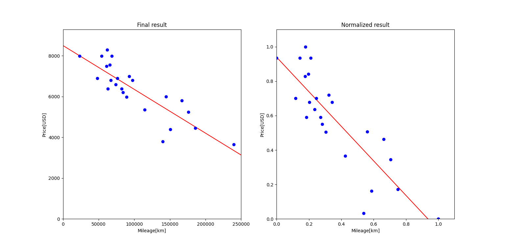

# ft_linear_regression
For this project, I created a program that predicts the price of a car by using a linear function train with a gradient descent algorithm.

## Related article I wrote
- [Implementation of Linear Regression Algorithms](https://medium.com/@hirok4/implementation-of-linear-regression-algorithms-4f1844ad4600)

<br></br>

## Estimate price
The estimation program will be used to predict the price of a car for a given mileage.
When you launch the program, it should prompt you for a mileage, and then give you back the estimated price for that mileage. The program will use the following
equation to predict the price :

$$
estimatePrice(mileage) = \theta_0 + (\theta_1 \times mileage) \tag{1}
$$

You can try the process by running the follow command. In the example below, the program will estimate the price of a car with 100000 km.

```bash
python estimate_price.py --mileage 100000 --param_yaml param.yaml
```

<br></br>

## Train with a gradient descent algorithm
Training program read dataset file and perform a linear regression on the data.
Once the linear regression has completed, it will save the variables $\theta_0$ and $\theta_1$ for use in the estimation program.
The training procedure is as follows.

### **1. Normalize range**
If I used the values of the data as they were used for training, the training did not converge well. Therefore, I normalized the data and used it for training. I used [**scaling to a range**](https://developers.google.com/machine-learning/data-prep/transform/normalization#scaling-to-a-range) to normalize data.

$$
x=(x\prime - x_{min})/(x_{max}-x_{min}) \tag{2}
$$

Scaling to a range is a good choice when both of the following conditions are met:
- You know the approximate upper and lower bounds on your data with few or no outliers.
 - Your data is approximately uniformly distributed across that range.

### **2. Calculate gradient**
The cost function to be minimized is as follows. $m$ is the number of data.

$$
\frac{1}{m}\sum_{i=0}^{m-1}(price[i]-estimatePrice(mileage[i]))^2
\tag{3}
$$

The equation differentiated by each of $\theta_0$ and $=\theta_1$ is as follows.

$$
\begin{align*}
D_{\theta_0}&=\frac{\partial (costFunction)}{\partial_{\theta_0}}=\frac{\partial}{\partial_{\theta_0}}\left(\frac{1}{m}\sum_{i=0}^{m-1}(y_i-(\theta_1x_i+\theta_0))^2\right) \\
&=\frac{1}{m}\frac{\partial}{\partial_{\theta_0}}\left(\sum_{i=0}^{m-1}(y_i^2+\theta_1^2x_i^2+\theta^2+2\theta_1x_i\theta_0-2y_i\theta_1x_i-2y_i\theta_0)\right) \\
&=\frac{-2}{m}\sum_{i=0}^{m-1}(price[i]-estimatePrice(mileage[i]))
\end{align*} \tag{4}
$$

$$
\begin{align*}
D_{\theta_1}&=\frac{\partial (costFunction)}{\partial_{\theta_1}}=\frac{\partial}{\partial_{\theta_1}}\left(\frac{1}{m}\sum_{i=0}^{m-1}(y_i-(\theta_1x_i+\theta_0))^2\right) \\
&=\frac{1}{m}\frac{\partial}{\partial_{\theta_1}}\left(\sum_{i=0}^{m-1}(y_i^2+\theta_1^2x_i^2+\theta^2+2\theta_1x_i\theta_0-2y_i\theta_1x_i-2y_i\theta_0)\right) \\
&=\frac{-2}{m}\sum_{i=0}^{m-1}x_i(price[i]-estimatePrice(mileage[i]))
\end{align*} \tag{5}
$$

### **3. Update parameter with learning rate**
The values of $\theta_0$ and $\theta_1$ are updated using the learning rate value $L$.

$$
\theta_0=\theta_0-LD_{\theta_0},
\theta_1=\theta_1-LD_{\theta_1} \tag{6}
$$

### **4. Calculate cost function**
We will repeat this process until the cost function Eq(3) is very small (ideally 0).

### **5. Convert normalized value back to original value**
Since the $\theta_0$ and $\theta_1$ obtained are values in normalized data, they must be restored to the original data scale.

$$
x_{original}=x_{norm}(x_{max}-x_{min})+x_{min} \tag{7}
$$

<br></br>

You can try the process by running the follow command.

```bash
python train.py --csv_file_path data.csv --output_param_path param.yaml
```

The graph of result is below image.



<br></br>

## References
- [Gradient descent](https://en.wikipedia.org/wiki/Gradient_descent)
- [Linear function](https://en.wikipedia.org/wiki/Linear_function)
- [Gradient Descent in Linear Regression](https://www.analyticsvidhya.com/blog/2021/04/gradient-descent-in-linear-regression/)
- [Linear Regression using Gradient Descent](https://towardsdatascience.com/linear-regression-using-gradient-descent-97a6c8700931)
- [Normalization](https://developers.google.com/machine-learning/data-prep/transform/normalization)
